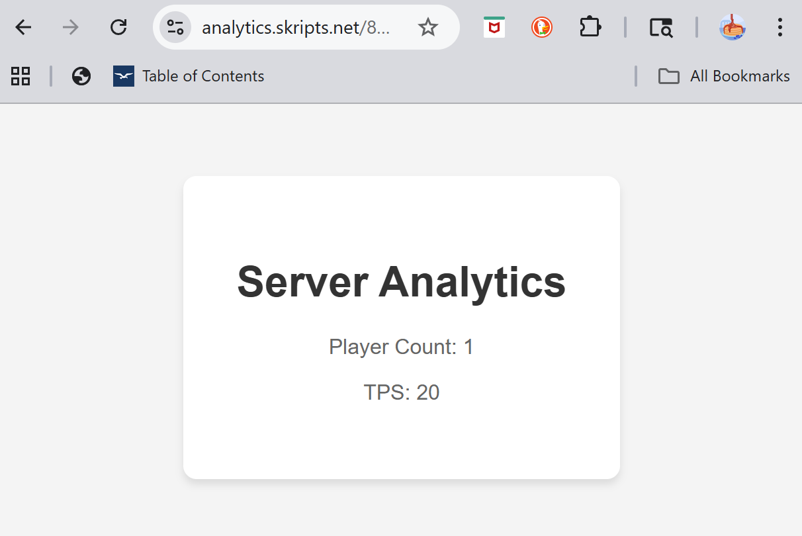

# Analytics Plugin 
> **Project Type:** Personal project   
> **Project Description:** Online analytics dashboard for your Minecraft server   
> **Project Goal:** Published plugin + webapp   
> **Languages & Technologies:** Java, TypeScript, React, Next.js, Tailwind CSS   

## MC Plug-in + Web Dashboard

### Plug-in:
java
- Connect to Database via UID
- Auth stuff
- Gather server info & update Database

### Web Dashboard:
Next.js, React, Tailwind CSS
- Secure account creation
- Server creation: Generate UID & database stuff 
- Separate per-server dashboards under same account
- Main dashboard: compilation of all servers under account
- Display live & historical server data from database


### Proof of Concept

#### Skript
```
on load:
	if {skripts.net::analytics::uuid} is not set:
		set {skripts.net::analytics::uuid} to join (16 random alphanumeric characters between "0" and "z") with ""
		set {skripts.net::analytics::link} to "https://analytics.skripts.net/%{skripts.net::analytics::uuid}%"

every minute:
	set {_playerCount} to online player count
	set {_tps} to tps from last minute
	set {_uuid} to {skripts.net::analytics::uuid}

	set {_jsonBody} to "{""uuid"":""%{_uuid}%"",""playerCount"":%{_playerCount}%,""tps"":%{_tps}%}"

	set {_request} to new http request with method "POST"
	set {_request}'s target url to "https://analytics-api.skripts.net/analytics/%{_uuid}%"
	set {_request}'s header "Content-Type" to "application/json"
	set {_request}'s header "User-Agent" to "MinecraftServer/1.0"
	set {_request}'s body to {_jsonBody}

	send async web request with {_request}

command analytics:
	trigger:
		send formatted "&d&lSkripts.net &8| &7View your server's analytics at <link:%{skripts.net::analytics::link}%>&6%{skripts.net::analytics::link}%" to player 

```

#### Web Dashboard
https://analytics.skripts.net/8GPVOGIA1DRGKBH8
 

