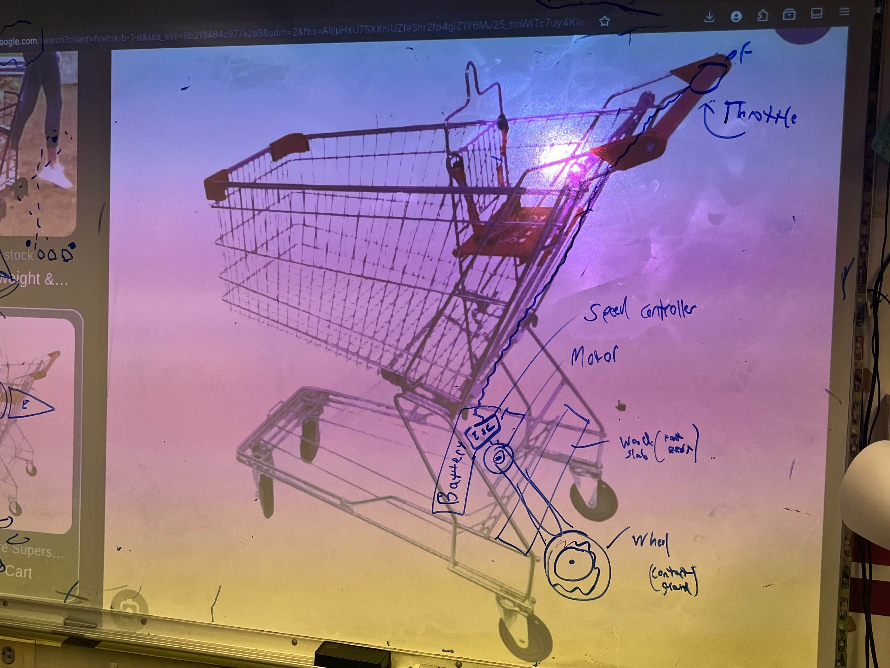

# Kilobyte
> **Project Type:** Personal project   
> **Project Description:** Detachable rig to transform an ordinary shopping cart into a motorized one   
> **Project Goal:** Learn about electronics, hardware, and functional 3D printing   
> **Languages & Technologies:** Electrical Systems, CAD, 3D Printing   

## Components
- Shopping Cart
- Motors
- Wheels
- Motor Controllers
- Potentiometer, Switchs, Buttons
- Arduinos
- LifePO4 Battery

## Design
#### Handle
##### Control Panel
- on/off switch
- forward/reverse switch
- Potentiometer to control speed
- Buttons for throttle (left/right)
#### Bottom
- Battery mounted at front for power (and weight balance)
- Electronics
- Motor & drive train 
- Wood standing platform
- Rear wheels

## Original Blueprints

