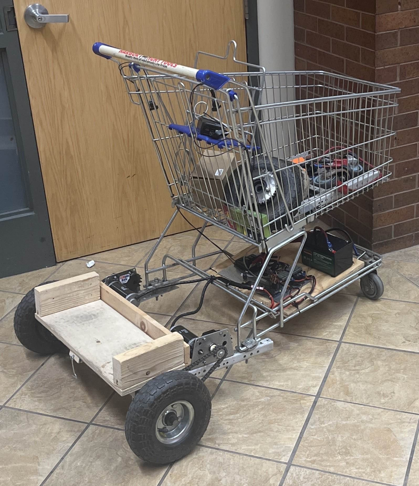

# Kilobyte
> **Project Type:** Personal project   
> **Project Description:** Detachable rig to transform an ordinary shopping cart into a motorized one   
> **Project Goal:** Learn about electronics, hardware, and functional 3D printing   
> **Languages & Technologies:** Electrical Systems, CAD, 3D Printing   

## **K**inetic **I**nnovitive **L**oad **O**ptimizing **B**asket for **Y**our **T**ransportation **E**fficiency

## Components
- Shopping Cart
- Motors
- Wheels
- Motor Controllers
- Potentiometer, Switchs, Buttons
- Arduinos
- LifePO4 Battery

## Design
#### Handle
- Buttons for throttle (left/right)
##### Control Panel
- on/off switch (w/ status LED)
- forward/reverse switch (w/ status LED)
- Potentiometer to control speed
- Digital display for:
	- Battery percentage & voltage
	- Throttle percentage
	- Forward/Reverse status
	- Controller connection status

#### Bottom
- Battery mounted at front for power (and weight balance)
- Electronics
- Motor & drive train 
- Wood standing platform
- Rear wheels

## Timeline

The original blueprints for Kilobyte, at the time simply named "Motorized Shopping Cart", were much simpler than current designs. The cart would include one wheel at the back, with one central throttle. This design failed to take into account steering and stability. 

The first prototype was completed overnight for CSH's Major-projectathon by myself and Tyler Severino. This design reflects many fundamental changes to our plans for Kilobyte. We decided to change from a one wheel design to a two wheel design. Our design features two rear wheels, each with their own motor and throttle. This allows for steering, greater stability, and more power overall. In this prototype, throttle buttons were loosley held onto the handle, and the potentiometer was mounted at the bottom, used to control velocity. Velocity control (speed & direction) were based on potentiometer values 0-255 where, 0-127 sets reverse speeds, 128 is idle, and 129-255 set forward speeds. 

The next iteration of Kilobyte introduces many structural and user interface improvements. The most prominent new feature is the control panel. The control panel includes many useful features and status displays. The right-most button is on/off (with a status LED), the left-most button is forward/reverse (with a status LED), and the potentiometer in the middle controls speed (not velocity anymore). Additionally, there is a digital display to show battery percentage/voltage, throttle percentage, forward/reverse status, and controller connectivity status (for plans to make Kilobyte controllable with an xbox controller). Also coming with this version, electronics were reorganized, with many being placed within the control panel, and structural improvements were made to the bottom. 

