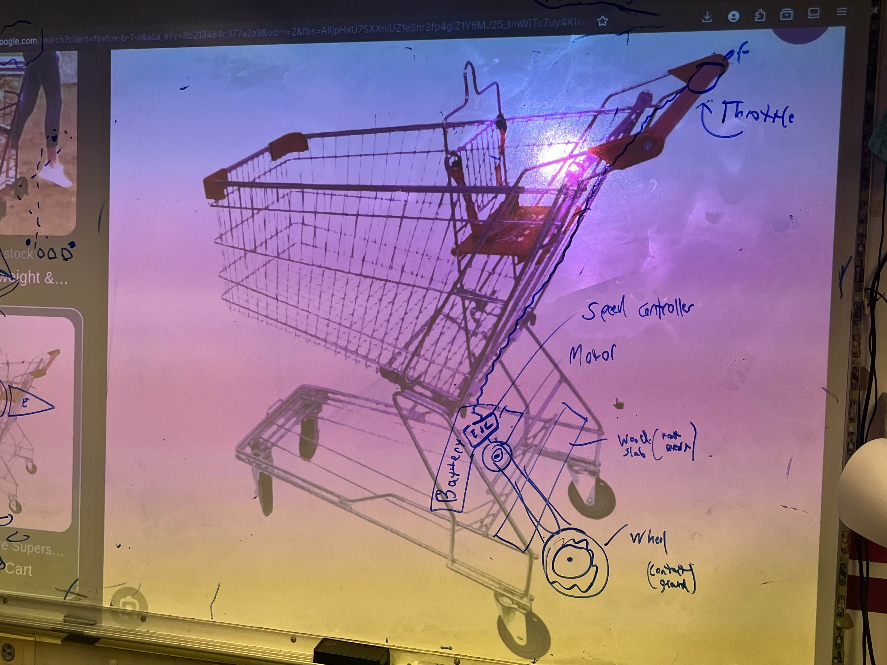

# Motorized Shopping Cart
> **Project Type:** Personal Project  
> **Project Goal:** Create an electrically powered motorized shopping cart   
> **Languages & Technologies:** Electrical & Embedded Systems, CAD, 3D Printing

## Idea
Easily removable/reattachable rig to transform an ordinary shopping cart into a motorized one. 

## Components
- Shopping Cart
- Motor
- Wheel
- Motor Controller
- Rotary Encoder / Potentiometer, Switch, Button
- Rasberry Pi Pico (If using rotary encoder)
- Car Battery

## Design
#### Handle
- on/off switch
- Rotary Encoder / Potentiometer to controll speed
- Button for throttle (stop/go)
#### Bottom
- Car battery mounted at front for power (and weight balance)
- Electronics
- Motor & drive train 
- Wood plank (for standing & part mounting)
- Wheel (off the back, in the middle)

## Original Blueprints

